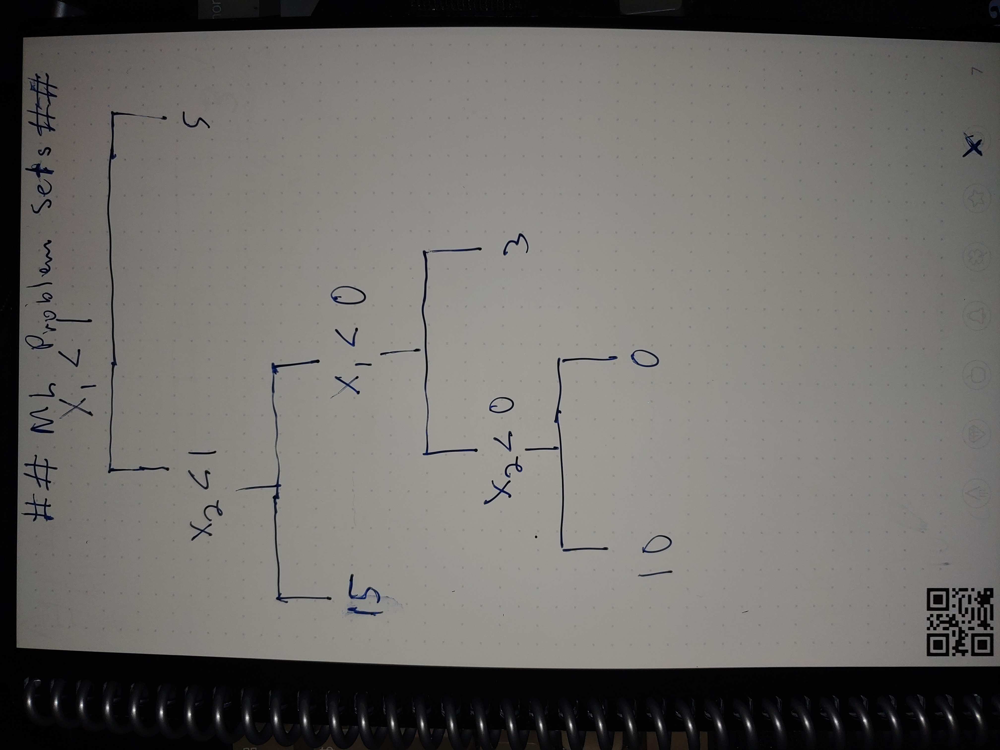

```{r}


gc()
rm(list=ls())
options(scipen = 999)

setwd("C:/R Studio Files/POLS6394-Machine-Learning/Problem Set 4")

#4

#a

```



```

#b

plot(NA, NA, type = "n", xlim = c(-3, 3), ylim = c(-3, 3), xlab = "X1", ylab = "X2")
lines(x = c(-3, 3), y = c(2, 2))
lines(x = c(-3, 3), y = c(1, 1))
lines(x = c(0, 0), y = c(1, 2))
lines(x = c(1, 1), y = c(-3, 1))
text(x = -1/2, y = -1, labels = -1.8)
text(x = 1.5, y = -1, labels = 0.63)
text(x = 0, y = 2.5, labels = 2.49)
text(x = -1, y = 1.5, labels = -1.06)
text(x = 1, y = 1.5, labels = 0.21)

```


